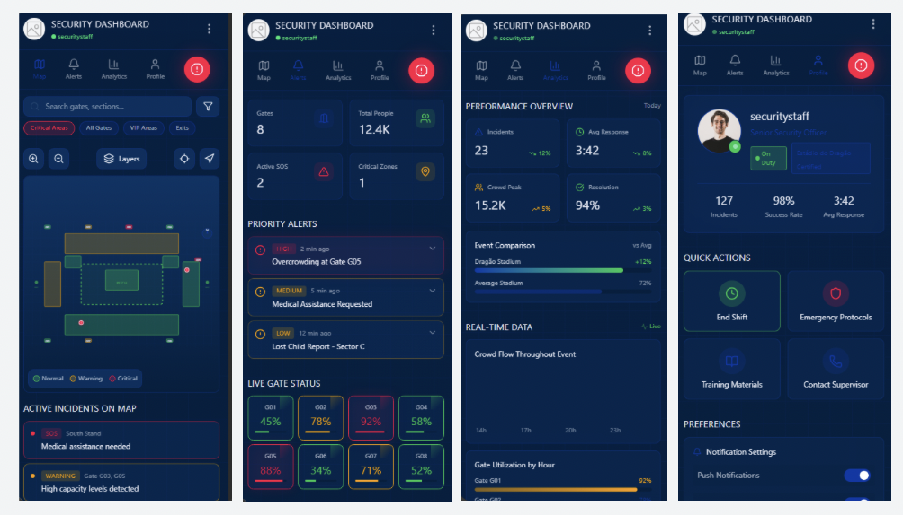
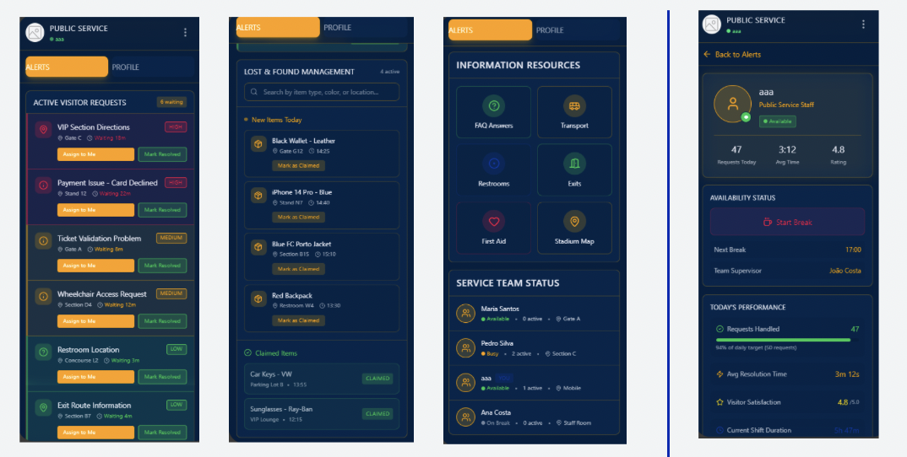
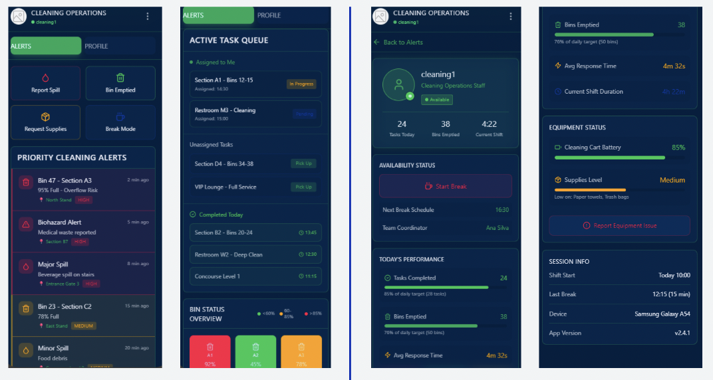

# Milestone 2: Elaboration Phase & System Design

**Status:** ✅ **Completed**  
**Due Date:** December 1, 2025  
**Focus:** Requirements Elicitation, System Architecture, UI/UX Design

---

## 1. Overview

This milestone marks the completion of the Elaboration Phase in the OpenUP methodology. The primary goal was to establish a detailed understanding of system requirements and define a stable, scalable architecture as the foundation for development.

All key deliverables for this phase have been completed, including detailed use case analysis, architectural design, UI mockups, and technical specifications.

---

## 2. Requirements Elicitation

### 2.1 Information Gathering & Analysis
The requirements were derived through comprehensive analysis of real stadium operations, benchmarking against existing solutions, and direct collaboration with stakeholders. Key sources included:
- **Interviews** with supervisors and stadium staff
- **Documentation analysis** of existing operational procedures
- **Integration planning** with the existing Fan App ecosystem
- **Workflow validation** against real event-operation practices

### 2.2 Actors (System Users)
Four primary actors were identified:

| Actor | Role & Responsibilities |
|-------|------------------------|
| **Gestor de Operações** | Overall stadium supervision, strategic decisions, incident assignment, emergency mode activation |
| **Supervisor de Zona** | Zone-specific safety and operations management, alert reception, team communication, local monitoring |
| **Staff no Terreno** | Field operatives (security, paramedics, support staff) responsible for incident response, navigation, and on-site actions |
| **Sistema** | Automated functions: alert sending, route calculation, real-time data provision |

### 2.3 Use Cases (Functional Requirements)
Use cases are organized by functional subsystems:

#### Consciência Situacional
- **UC01:** Ver mapa de calor (Crowd density visualization)
- **UC02:** Ver localização do staff (Real-time staff tracking)
- **UC03:** Filtrar staff por tipo/estado (Staff filtering by type/status)

#### Gestão de Incidentes
- **UC04:** Reportar incidente (Incident reporting)
- **UC05:** Receber alerta automático (Automatic alert reception)
- **UC06:** Ver lista de incidentes (Incident list view)
- **UC07:** Atribuir incidente (Incident assignment)
- **UC08:** Aceitar/Recusar incidente (Incident acceptance/rejection)

#### Navegação e Rotas
- **UC09:** Calcular rota para incidente (Route calculation to incidents)
- **UC10:** Navegar para pontos de interesse (Navigation to POIs)

#### Modo de Emergência
- **UC11:** Ativar modo de emergência (Emergency mode activation)
- **UC12:** Ver rotas de evacuação (Evacuation route viewing)
- **UC13:** Ver instruções de emergência (Emergency instructions)

#### Comunicação
- **UC14:** Chat de grupo (Group chat)
- **UC15:** Chat por zona geográfica (Geographic zone chat)
- **UC16:** Botão de SOS (SOS button)

#### Gestão Operacional
- **UC17:** Consultar dashboard operacional (Operational dashboard)

---

## 3. System Architecture

### 3.1 High-Level Architecture

*System architecture showing microservices deployment, data flow, and integration points.*

### 3.2 Use Case Diagrams

### 3.3 Deployment Architecture

### 3.4 Domain Model

### 3.5 Technology Stack

| Component | Technology | Rationale |
|-----------|------------|-----------|
| **Core Microservices** | Java (Spring Boot) | Stability, performance, team expertise |
| **WebSocket Gateway** | Node.js + NestJS | High WebSocket connection handling, Kafka integration |
| **Message Broker** | Apache Kafka | High-throughput event streaming for sensors and history |
| **Analytics/Simulation** | Python/Flask or FastAPI | Heavy processing (simulations, heatmap calibration) |
| **Database** | PostgreSQL (relational), Redis (presence) | Relational data + real-time presence tracking |
| **Container Orchestration** | Kubernetes | Microservices management and scaling |
| **Authentication** | Spring Security (OAuth2/JWT) | Industry-standard security |

### 3.6 Microservices Architecture

| Service | Technology | Purpose |
|---------|------------|---------|
| Auth Service | Java/Spring Boot | Authentication & authorization |
| WebSocket Gateway | Node.js/NestJS | Real-time bidirectional communication |
| Crowd Service | Java | Crowd density and movement analysis |
| Heatmap/Aggregator | Python/Java | Heatmap generation and data aggregation |
| Map Service | Java | Stadium maps and geospatial data |
| Pathfinding Service | Java | Optimal route calculation (A* algorithm) |
| Emergency Service | Java | Emergency mode and SOS handling |
| Maintenance Service | Java | System health and operational alerts |
| Synthetic Data Generator | Python/Flask | Test data generation for development |

### 3.7 Key Architectural Decisions
1. **Microservices Approach**: Enables independent scaling and deployment of system components
2. **WebSocket for Real-time**: Essential for live location updates, alerts, and chat functionality
3. **Kafka for Event Streaming**: Robust handling of high-frequency sensor data and system events
4. **Multi-language Backend**: Java for core stability, Python for analytics, Node.js for WebSocket efficiency
5. **Kubernetes Orchestration**: Ensures high availability and simplified DevOps operations

---

## 4. UX/UI Design

### 4.1 UI Mockups

### 4.2 UX Guidelines Principles
- **Simplicidade**: Direct workflows with minimal steps
- **Ações frequentes em destaque**: Critical buttons (SOS, report incident) always accessible
- **Feedback imediato**: Visual/tactile confirmation for all actions
- **Minimizar erros**: Critical actions protected by confirmation
- **Consistência**: Uniform navigation, colors, icons, and interaction patterns

### 4.3 UI Specifications
- **Color Coding**:
  - Verde → Normal status
  - Amarelo → Attention required
  - Vermelho → Critical situation
- **Visual Hierarchy**: Clear titles, prominent buttons, discreet secondary content
- **Universal Icons**: Location, chat, alert, incident, emergency
- **Clean Layouts**: Avoid information overload on single screens
- **Large Buttons**: Designed for one-handed use while moving

### 4.4 Acessibilidade
- Minimum font size: 14-16px for readability while moving
- High contrast between text and background (sunlight visibility)
- Large, well-spaced buttons to prevent mis-taps
- Icon + text combinations (no standalone icons)
- Tactile feedback (light vibration) for critical actions

### 4.5 Internacionalização (PT/EN)
- Real-time language switching capability
- Button text limited to 2-3 words for both languages
- Avoid language-specific abbreviations
- Layouts accommodate longer Portuguese text without breaking
- Translation file system for consistent localization

### 4.6 UI Mapping & User Flows
1. **Acesso Inicial e Autenticação**: Login → Menu Principal (role-based access)
2. **Consciência Situacional**: Menu → Mapa (heatmap, staff location, filters)
3. **Gestão de Incidentes**: Menu → Incidentes (list view, details, report via "+" button)
4. **Navegação e Rotas**: From incident → "Ver Rota" or Menu → Pontos de Interesse
5. **Modo de Emergência**: Menu → Emergência (activation, critical mode interface)
6. **Comunicação**: Menu → Chat (group/zone) or SOS button from any screen
7. **Gestão Operacional**: Menu → Dashboard (real-time statistics and KPIs)

---

## 5. Assumptions & Dependencies

### 5.1 Technical Assumptions

| Category | Assumption | Impact |
|----------|------------|---------|
| **Stadium Infrastructure** | Minimal WIFI coverage for all staff | Essential for real-time connectivity |
| **Stadium Infrastructure** | Network latency < 100ms | Critical for real-time operations |
| **Mobile/App** | Android 10+ devices | Development target platform |
| **Mobile/App** | Stable WebSocket connections | Required for real-time features |
| **Mobile/App** | High-frequency event handling | Necessary for heatmaps/alerts |
| **Mobile/App** | Staff allowed device usage during service | Fundamental for system adoption |
| **Data** | Real test data for heatmap calibration | Required for accurate modeling |
| **Data** | Up-to-date stadium map/route data | Essential for navigation accuracy |
| **Security** | TLS/HTTPS end-to-end | Non-negotiable for security |
| **Security** | OAuth2/JWT authentication acceptance | Standard security implementation |
| **Backend** | Node.js/NestJS WebSocket gateway compatibility | Technical feasibility |
| **Backend** | Kafka supported by DevOps | Infrastructure requirement |
| **Backend** | Critical backend in Java maintainable | Architecture decision |
| **Team** | Java and Node.js knowledge available | Team capability assumption |

### 5.2 External Dependencies
- Client-provided Wi-Fi and internal network access
- Stadium internal maps and sector positioning data
- Staff lists and organizational structure
- Historical crowd data for algorithm training
- DevOps configuration of PostgreSQL and Kafka cluster
- Frontend team implementation of UI components
- Development of mockups/UI design
- Configuration of simulated stadium sensors and environment

---

## 6. Development Planning

### 6.1 Component Breakdown & Story Points

| Component | Size | Story Points | Complexity |
|-----------|------|--------------|------------|
| Pathfinding Engine | XL | 20 | High algorithm complexity |
| Synthetic Data Generator | XL | 20 | Data modeling and simulation |
| Map Service | L | 13 | Geospatial data handling |
| Heatmap Service | L | 13 | Real-time data aggregation |
| WebSocket Gateway | L | 13 | High-concurrency handling |
| Crowd Service | M | 8 | Density algorithm implementation |
| Emergency/SOS Service | M | 8 | Critical system reliability |
| Kafka Integration Layer | M | 8 | Event streaming infrastructure |
| Auth Service | S | 5 | Standard security implementation |
| Maintenance Service | S | 5 | System monitoring and health |
| Notifications/Alerts Service | S | 5 | Real-time notification system |
| CI/CD Pipeline | S | 5 | Automated deployment and testing |

**Total Story Points: 119**

### 6.2 Staff-Specific Requirements Addressed
- ✅ Real-time crowd heatmaps and wait-times
- ✅ Emergency reporting and response system
- ✅ Automated maintenance alerts with routing
- ✅ Interactive stadium operations map
- ✅ Role-based staff interfaces (PT/EN)
- ✅ Automatic responder assignment
- ✅ Evacuation guidance & corridor closure updates
- ✅ Offline operation capability (cached essential data)

### 6.3 Shared System Requirements Implemented
- ✅ Unified stadium graph for navigation
- ✅ Congestion & wait-time engine
- ✅ Shared routing API for all services

---

## 7. Risk Assessment & Mitigation

| Risk | Probability | Impact | Mitigation Strategy |
|------|-------------|--------|---------------------|
| **Wi-Fi Coverage Gaps** | Medium | High | Offline mode with local caching; mesh network backup |
| **High Network Latency** | Low | High | Edge computing; data prioritization; compression |
| **Device Compatibility** | Low | Medium | Android 10+ minimum; progressive enhancement |
| **Real-time Data Volume** | High | Medium | Kafka streaming; data aggregation; load shedding |
| **Staff Adoption Resistance** | Medium | High | Intuitive UI; training; gradual rollout |
| **Integration Complexity** | High | High | API-first design; contract testing; mock services |
| **Emergency Mode Reliability** | High | Critical | Redundant systems; battery optimization; SOS fallback |

---

## 8. Next Steps (Transition to Construction Phase)

With Milestone 2 completed, the project moves into the Construction Phase with:

1. **Immediate Actions**:
   - Set up development environments for all technologies
   - Initialize microservices repositories
   - Begin implementation of core services (Auth, Map, WebSocket)
   - Start mobile app development with Flutter

2. **Short-term Goals**:
   - Complete CI/CD pipeline configuration
   - Implement basic incident management flow
   - Develop initial heatmap visualization
   - Establish real-time communication baseline

3. **Quality Gates for MS3**:
   - All microservices containerized and deployable
   - Basic mobile app prototype functional
   - Real-time location tracking operational
   - Incident reporting and assignment workflow complete

---

## 9. Supporting Artifacts

The following artifacts were produced during the Elaboration Phase and are available in the project repository:

1. **Use Case Diagrams** (`assets/diagrams/use_cases/`)
2. **System Architecture Diagram** (`assets/diagrams/architecture-diagram.png`)
3. **Deployment Diagram** (`assets/diagrams/deployement-diagram.png`)
4. **Domain Model** (`assets/diagrams/domain-diagram.png`)
5. **UI Mockups** (`assets/diagrams/ui-mockups/`)
6. **Presentation** (`assets/diagrams/powerpoint/milestone2.pdf`)

---

**Milestone 2 Approval Date:** November 2025  
**Next Milestone:** MS3 - MVP Implementation (December 1, 2025)

