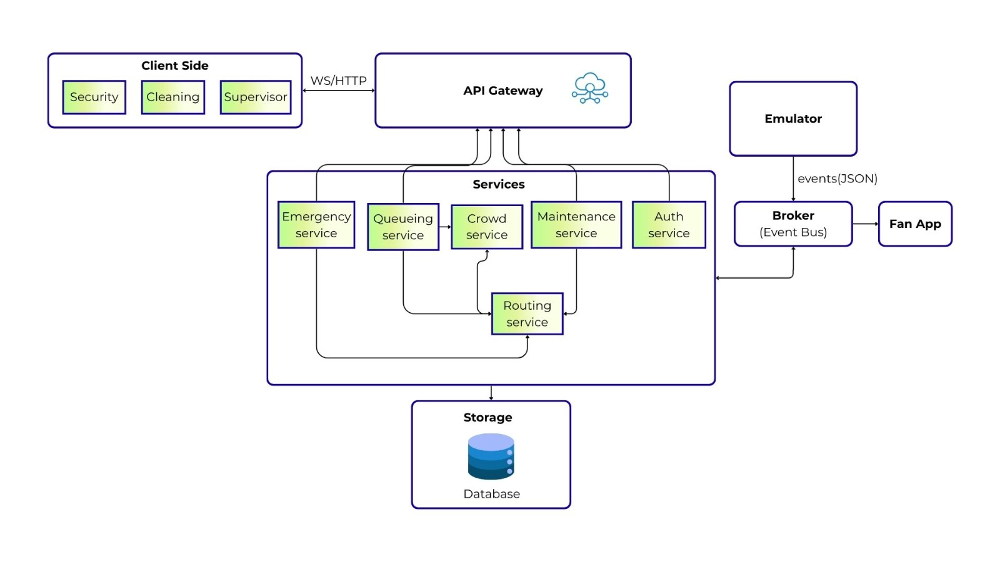
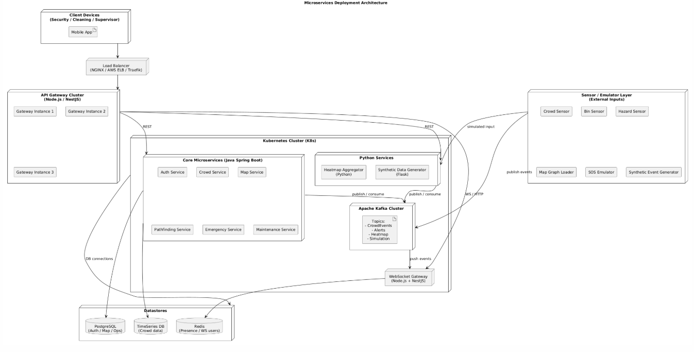
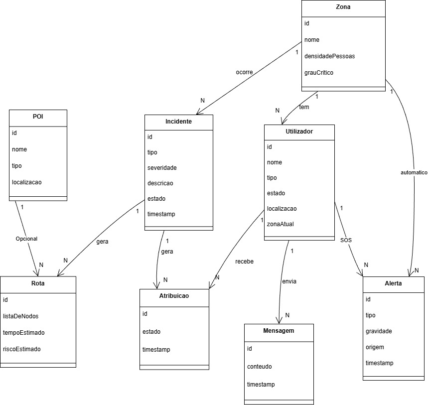

# System Architecture

## High-Level Overview


*Overall system architecture showing all major components and their interactions.*

## Deployment Architecture


*Physical and logical deployment of all system components across infrastructure layers.*

## Domain Model


*Core entities and relationships in the stadium operations domain.*

## Technology Stack

### Backend Services
| Service | Technology | Purpose | Owner |
|---------|------------|---------|-------|
| Auth Service | Java/Spring Boot | Authentication & authorization | Guilherme |
| WebSocket Gateway | Node.js/NestJS | Real-time communication | Guilherme |
| Crowd Service | Java/Spring Boot | Crowd density analysis | Solomiia |
| Pathfinding Service | Java/Spring Boot | Route calculation (A* algorithm) | Solomiia |
| Map Service | Java/Spring Boot | Geospatial data management | Guilherme |
| Emergency Service | Java/Spring Boot | SOS and emergency mode handling | Guilherme |
| Maintenance Service | Java/Spring Boot | System health monitoring | Diogo |
| Heatmap Service | Python/FastAPI | Heatmap generation and analytics | Solomiia |

### Data Layer
| Component | Technology | Purpose |
|-----------|------------|---------|
| Primary Database | PostgreSQL | Relational data storage (incidents, staff, zones) |
| Real-time Cache | Redis | Presence tracking, session data, live locations |
| Message Broker | Apache Kafka | Event streaming (sensor data, alerts, location updates) |
| Object Storage | MinIO/S3 | Map files, heatmap data, incident photos |
| Time-Series DB | TimescaleDB | Historical analytics and reporting |

### Mobile Application
| Layer | Technology | Purpose |
|-------|------------|---------|
| Framework | Flutter 3.0+ | Cross-platform mobile app development |
| State Management | Provider/Riverpod | Reactive app state management |
| Real-time Communication | WebSocket + Socket.io | Live updates and bidirectional communication |
| Mapping | Mapbox/Google Maps | Interactive stadium maps and navigation |
| Local Storage | Hive/SQLite | Offline data caching and persistence |
| Push Notifications | Firebase Cloud Messaging | Real-time alerts and notifications |

### Infrastructure & DevOps
| Component | Technology | Purpose |
|-----------|------------|---------|
| Container Orchestration | Kubernetes | Microservices deployment and scaling |
| Service Mesh | Istio | Service discovery, load balancing, security |
| CI/CD Pipeline | GitHub Actions | Automated testing and deployment |
| Monitoring | Prometheus + Grafana | System performance and health monitoring |
| Logging | ELK Stack (Elasticsearch, Logstash, Kibana) | Centralized logging and analysis |
| API Gateway | Kong/Nginx | Request routing, rate limiting, authentication |

## Microservices Communication

```mermaid
graph TB
    subgraph "Mobile Layer"
        MA[Mobile App - Flutter]
    end
    
    subgraph "API Gateway Layer"
        GW[WebSocket Gateway - Node.js/NestJS]
        AG[API Gateway - Kong]
    end
    
    subgraph "Event Streaming Layer"
        K[Apache Kafka Cluster]
    end
    
    subgraph "Core Services Layer"
        AS[Auth Service - Java]
        CS[Crowd Service - Java]
        PS[Pathfinding Service - Java]
        MS[Map Service - Java]
        ES[Emergency Service - Java]
    end
    
    subgraph "Analytics Layer"
        HS[Heatmap Service - Python]
        SS[Synthetic Data Generator - Python]
    end
    
    subgraph "Data Layer"
        PG[(PostgreSQL)]
        RD[(Redis)]
        TS[(TimescaleDB)]
        OS[(Object Storage)]
    end
    
    MA --> GW
    MA --> AG
    GW --> K
    AG --> K
    K --> AS
    K --> CS
    K --> PS
    K --> MS
    K --> ES
    K --> HS
    K --> SS
    
    AS --> PG
    CS --> RD
    PS --> PG
    MS --> OS
    ES --> PG
    HS --> TS
    SS --> TS
    
    HS -.->|heatmap data| OS
    MS -.->|map tiles| OS

