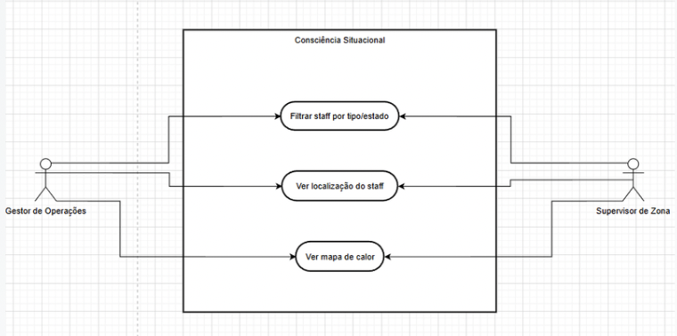
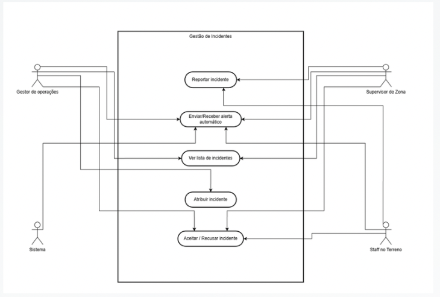
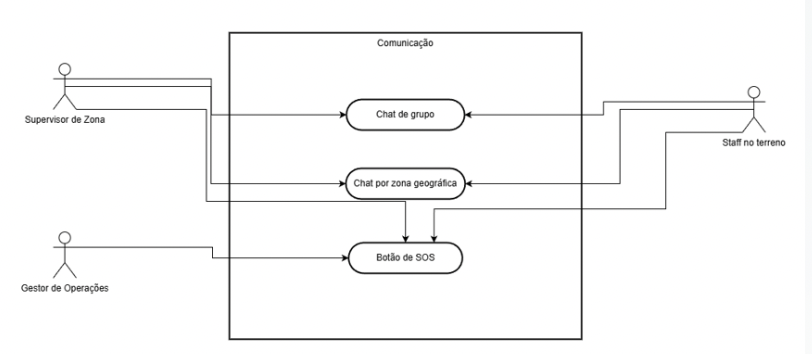
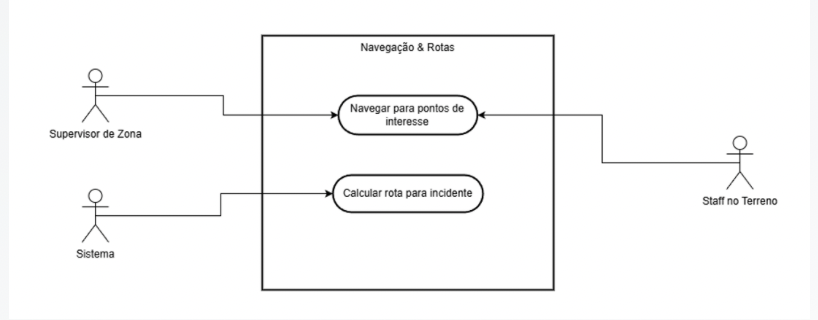
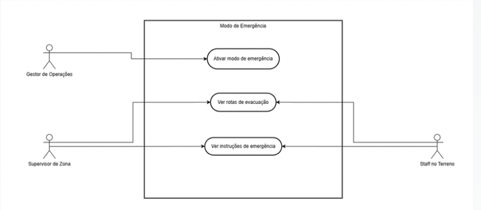
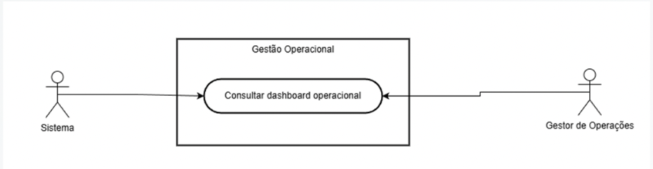

# Use Cases

## Overview

This document outlines the comprehensive use cases for the OpsLite Smart Stadium Staff Application. Use cases are organized by functional subsystems and user roles to provide clear understanding of system functionality and user interactions.

## Actors Definition

### Primary Actors
| Actor | Description | Responsibilities |
|-------|-------------|------------------|
| **Gestor de Operações** | Operations manager responsible for overall stadium supervision | Strategic decisions, incident assignment, emergency mode activation, overall coordination |
| **Supervisor de Zona** | Zone supervisor managing specific stadium areas | Local incident management, team communication, zone monitoring, staff coordination |
| **Staff no Terreno** | Field staff including security, cleaning, and emergency personnel | Incident response, navigation, on-site actions, status reporting |
| **Sistema** | Automated system components | Alert generation, route calculation, data processing, notifications |

### Secondary Actors
| Actor | Description | Interaction |
|-------|-------------|-------------|
| **Sistema Externa** | External systems (sensors, databases, third-party services) | Data exchange, integration points, event triggers |
| **Visitante** | Stadium visitor | Indirect interaction through crowd behavior and incidents |

## Use Case Diagrams

### 1. Consciência Situacional (Situational Awareness)

### 2. Gestão de Incidentes (Incident Management)

### 3. Comunicação (Communication)

### 4. Navegação (Navigation)

### 5. Emergência (Emergency)

### 6. Operações (Operations)

## Detailed Use Cases

### UC01: Ver Mapa de Calor (View Heatmap)
**ID:** UC01  
**Actors:** All Staff Roles  
**Preconditions:** User authenticated, system online, location services enabled  
**Main Flow:**
1. User opens application and navigates to main dashboard
2. System displays interactive stadium map
3. User selects heatmap overlay option
4. System retrieves real-time crowd data from sensors
5. System applies color coding (Green/Yellow/Red) based on density thresholds
6. User views heatmap with real-time updates
7. System highlights areas exceeding density thresholds

**Alternative Flows:**
- A1: Offline mode - system displays last cached heatmap data
- A2: Network latency - system shows loading state with timestamp of last update

**Postconditions:** User has situational awareness of crowd distribution

### UC02: Ver Localização do Staff (View Staff Location)
**ID:** UC02  
**Actors:** Supervisor, Operations Manager  
**Preconditions:** Staff location sharing enabled, user has appropriate permissions  
**Main Flow:**
1. User opens staff management view
2. System displays stadium map with staff location markers
3. User filters staff by role (security, cleaning, emergency)
4. System updates display showing only selected roles
5. User clicks on staff marker to view details
6. System shows staff information and current status

**Postconditions:** User can monitor staff deployment and availability

### UC03: Filtrar Staff por Tipo/Estado (Filter Staff by Type/Status)
**ID:** UC03  
**Actors:** Supervisor, Operations Manager  
**Preconditions:** Staff data available in system  
**Main Flow:**
1. User accesses staff list or map view
2. User selects filter options (role, status, zone)
3. System applies filters and updates display
4. User views filtered staff information

**Postconditions:** User can focus on specific staff subsets

### UC04: Reportar Incidente (Report Incident)
**ID:** UC04  
**Actors:** All Staff Roles  
**Preconditions:** User authenticated and located within stadium  
**Main Flow:**
1. User identifies incident requiring reporting
2. User clicks "Report Incident" button
3. System presents incident type selection
4. User selects incident type (security, medical, maintenance, other)
5. System shows form with relevant fields
6. User completes form and submits
7. System validates and stores incident
8. System notifies appropriate staff based on incident type
9. System confirms incident reported successfully

**Alternative Flows:**
- A1: Quick report - user selects predefined incident templates
- A2: Photo/video attachment - user adds media evidence

**Postconditions:** Incident recorded and response initiated

### UC05: Receber Alerta Automático (Receive Automatic Alert)
**ID:** UC05  
**Actors:** All Staff Roles  
**Preconditions:** User authenticated, notification permissions granted  
**Main Flow:**
1. System detects condition requiring alert
2. System identifies affected staff/users
3. System sends push notification with alert details
4. User receives notification on device
5. User acknowledges/views alert details
6. System logs acknowledgement

**Postconditions:** User aware of critical situation requiring attention

### UC06: Ver Lista de Incidentes (View Incident List)
**ID:** UC06  
**Actors:** All Staff Roles  
**Preconditions:** User authenticated, incidents exist in system  
**Main Flow:**
1. User navigates to incidents section
2. System retrieves and displays incident list
3. User filters/sorts incidents by various criteria
4. User selects incident for detailed view
5. System shows complete incident information
6. User takes action if appropriate (accept, escalate, resolve)

**Postconditions:** User has overview of current incidents

### UC07: Atribuir Incidente (Assign Incident)
**ID:** UC07  
**Actors:** Supervisor, Operations Manager  
**Preconditions:** Incident reported, staff available  
**Main Flow:**
1. User selects unassigned incident
2. System suggests available staff based on location and skills
3. User selects staff member for assignment
4. System sends assignment notification to staff
5. Staff acknowledges assignment
6. System updates incident status to "assigned"

**Postconditions:** Incident assigned to specific staff member

### UC08: Aceitar/Recusar Incidente (Accept/Reject Incident)
**ID:** UC08  
**Actors:** Field Staff  
**Preconditions:** Incident assigned to user  
**Main Flow:**
1. User receives incident assignment notification
2. User reviews incident details
3. User accepts or rejects assignment
4. If accepted, system updates incident status and provides navigation
5. If rejected, system notifies supervisor and suggests alternatives

**Postconditions:** Incident assignment confirmed or reassigned

### UC09: Calcular Rota para Incidente (Calculate Route to Incident)
**ID:** UC09  
**Actors:** Field Staff  
**Preconditions:** Incident location known, user location known  
**Main Flow:**
1. User accepts incident assignment
2. System calculates optimal route using A* algorithm
3. System considers hazards, closures, and crowd density
4. System displays route on map with turn-by-turn instructions
5. User follows route to incident location
6. System provides real-time route updates based on changing conditions

**Alternative Flows:**
- A1: Hazard detection - system recalculates route avoiding new hazards
- A2: Offline mode - system uses cached map data for routing

**Postconditions:** User navigated efficiently to incident location

### UC10: Navegar para Pontos de Interesse (Navigate to Points of Interest)
**ID:** UC10  
**Actors:** All Staff Roles  
**Preconditions:** POI database available, user location known  
**Main Flow:**
1. User accesses POI directory
2. User selects POI (gates, first aid stations, equipment rooms, etc.)
3. System calculates route to selected POI
4. User follows navigation instructions
5. System provides arrival confirmation

**Postconditions:** User successfully navigated to specified POI

### UC11: Ativar Modo de Emergência (Activate Emergency Mode)
**ID:** UC11  
**Actors:** Operations Manager  
**Preconditions:** Emergency situation confirmed, appropriate authorization  
**Main Flow:**
1. User confirms emergency situation
2. User activates emergency mode from secure menu
3. System requests confirmation with reason
4. User provides emergency reason and confirms
5. System activates emergency protocols
6. All staff devices switch to emergency interface
7. System prioritizes emergency communications
8. Emergency procedures initiated automatically

**Postconditions:** System in emergency response mode

### UC12: Ver Rotas de Evacuação (View Evacuation Routes)
**ID:** UC12  
**Actors:** All Staff Roles  
**Preconditions:** Emergency mode active or evacuation needed  
**Main Flow:**
1. User accesses emergency interface
2. System displays evacuation routes based on user location
3. User selects destination (assembly point, exit, safe zone)
4. System calculates safest evacuation route
5. User follows guided evacuation instructions
6. System provides real-time updates on route safety

**Postconditions:** User guided to safety during evacuation

### UC13: Ver Instruções de Emergência (View Emergency Instructions)
**ID:** UC13  
**Actors:** All Staff Roles  
**Preconditions:** Emergency situation active  
**Main Flow:**
1. User accesses emergency interface
2. System displays role-specific emergency procedures
3. User reviews step-by-step instructions
4. System provides quick access to emergency contacts
5. User follows instructions as needed

**Postconditions:** User aware of emergency procedures

### UC14: Chat de Grupo (Group Chat)
**ID:** UC14  
**Actors:** All Staff Roles  
**Preconditions:** User authenticated, group exists  
**Main Flow:**
1. User accesses chat interface
2. User selects group chat (by role, by zone, by shift)
3. User sends message to group
4. System delivers message to all group members
5. Group members receive and can respond to messages

**Alternative Flows:**
- A1: Multimedia messages - user sends photos or location pins
- A2: Priority messages - user marks message as high priority

**Postconditions:** Group communication established

### UC15: Chat por Zona Geográfica (Geographic Zone Chat)
**ID:** UC15  
**Actors:** All Staff Roles  
**Preconditions:** User location known, zone boundaries defined  
**Main Flow:**
1. User enters specific stadium zone
2. System automatically adds user to zone chat
3. User sends/receives messages from others in same zone
4. When user leaves zone, system removes from zone chat

**Postconditions:** Location-based communication enabled

### UC16: Botão de SOS (SOS Button)
**ID:** UC16  
**Actors:** All Staff Roles  
**Preconditions:** User authenticated, location services enabled  
**Main Flow:**
1. User encounters emergency requiring immediate assistance
2. User activates SOS button (hard press or screen button)
3. System sends SOS alert with user location and details
4. System notifies nearest emergency responders
5. System initiates emergency protocols
6. Responders acknowledge and navigate to user
7. System provides status updates to user

**Alternative Flows:**
- A1: False alarm - user cancels SOS within grace period
- A2: No response - system escalates to next available responder

**Postconditions:** Emergency assistance dispatched to user

### UC17: Consultar Dashboard Operacional (View Operational Dashboard)
**ID:** UC17  
**Actors:** Supervisor, Operations Manager  
**Preconditions:** User has dashboard access permissions  
**Main Flow:**
1. User accesses dashboard interface
2. System displays key operational metrics
3. User can view different dashboard widgets
4. User can customize dashboard layout
5. System provides real-time updates on metrics
6. User can drill down into specific data points

**Postconditions:** User has comprehensive operational overview

## Non-Functional Requirements

### Performance Requirements
- **Response Time**: < 100ms for critical operations
- **Update Frequency**: Real-time updates every 1-5 seconds as appropriate
- **Concurrent Users**: Support for 500+ simultaneous staff users
- **Data Synchronization**: < 2 second delay across all devices

### Reliability Requirements
- **Availability**: 99.9% uptime during events
- **Error Rate**: < 0.1% failed transactions
- **Recovery Time**: < 30 seconds for service restoration
- **Data Integrity**: No data loss in normal operation

### Usability Requirements
- **Learnability**: New users proficient within 30 minutes
- **Efficiency**: Critical tasks completable in < 3 steps
- **Error Prevention**: Clear validation and confirmation for critical actions
- **Accessibility**: WCAG 2.1 AA compliance for visual elements

### Security Requirements
- **Authentication**: Multi-factor authentication for sensitive operations
- **Authorization**: Role-based access control for all functions
- **Data Protection**: Encryption of all sensitive data in transit and at rest
- **Audit Logging**: Complete audit trail for all system actions

## Use Case Relationships

### Includes Relationships
- UC04 (Report Incident) includes UC09 (Calculate Route) when assigning location-based incidents
- UC11 (Emergency Mode) includes UC12 (Evacuation Routes) and UC13 (Emergency Instructions)
- UC16 (SOS Button) includes UC05 (Automatic Alert) for notification

### Extends Relationships
- UC02 (Staff Location) extends UC03 (Staff Filtering) for advanced filtering
- UC06 (Incident List) extends UC07 (Assign Incident) for assignment workflow
- UC14 (Group Chat) extends UC15 (Zone Chat) for location-based variations

### Specialization Relationships
- Security Staff specialize UC04 with security-specific incident types
- Cleaning Staff specialize UC04 with maintenance-specific incidents
- Medical Staff specialize UC04 with medical emergency incidents

## Usage Scenarios

### Scenario 1: Major Crowd Incident
1. **UC02**: Supervisor monitors crowd heatmap
2. **UC04**: Security staff reports crowd surge incident
3. **UC05**: System sends automatic alerts to nearby staff
4. **UC07**: Supervisor assigns incident to available security teams
5. **UC09**: Assigned teams navigate to incident location
6. **UC14**: Teams coordinate via group chat during response
7. **UC17**: Operations manager monitors situation via dashboard

### Scenario 2: Medical Emergency
1. **UC16**: Staff member activates SOS for medical emergency
2. **UC05**: System alerts nearest medical responders
3. **UC09**: Medical team navigates to emergency location
4. **UC15**: Zone-based chat coordinates with other staff in area
5. **UC04**: Incident formally reported for documentation
6. **UC17**: Supervisor tracks response time and outcome

### Scenario 3: Preventive Maintenance
1. **UC05**: System detects full bin via sensors, sends maintenance alert
2. **UC08**: Cleaning staff accepts maintenance assignment
3. **UC09**: Staff navigates to bin location with optimal route
4. **UC04**: Staff completes maintenance and reports resolution
5. **UC17**: Operations views maintenance completion metrics

## Traceability Matrix

| Use Case ID | Related Features | Priority | Status | Test Cases |
|-------------|------------------|----------|--------|------------|
| UC01 | Heatmap visualization, Real-time updates | High | Planned | TC-101 to TC-110 |
| UC02 | Staff tracking, Location services | High | Planned | TC-201 to TC-210 |
| UC03 | Filtering, Search functionality | Medium | Planned | TC-301 to TC-305 |
| UC04 | Incident reporting, Forms, Attachments | Critical | Planned | TC-401 to TC-420 |
| UC05 | Push notifications, Alert system | Critical | Planned | TC-501 to TC-510 |
| UC06 | Incident list, Filtering, Sorting | High | Planned | TC-601 to TC-610 |
| UC07 | Assignment logic, Staff matching | High | Planned | TC-701 to TC-715 |
| UC08 | Assignment acceptance, Workflow | Medium | Planned | TC-801 to TC-805 |
| UC09 | Routing algorithm, Map integration | Critical | Planned | TC-901 to TC-920 |
| UC10 | POI database, Navigation | Medium | Planned | TC-1001 to TC-1010 |
| UC11 | Emergency protocols, Mode switching | Critical | Planned | TC-1101 to TC-1110 |
| UC12 | Evacuation planning, Route calculation | Critical | Planned | TC-1201 to TC-1210 |
| UC13 | Emergency procedures, Quick reference | High | Planned | TC-1301 to TC-1305 |
| UC14 | Chat system, Group management | High | Planned | TC-1401 to TC-1415 |
| UC15 | Geofencing, Location-based services | Medium | Planned | TC-1501 to TC-1510 |
| UC16 | SOS functionality, Emergency response | Critical | Planned | TC-1601 to TC-1615 |
| UC17 | Dashboard, Analytics, Reporting | High | Planned | TC-1701 to TC-1720 |

## Future Use Cases (Post-MVP)

### UC18: Predictive Crowd Analytics
- AI-based prediction of crowd movements
- Early warning for potential bottlenecks
- Preventive staff deployment recommendations

### UC19: Equipment Inventory Management
- Track maintenance equipment locations
- Check-in/check-out system for gear
- Maintenance scheduling for equipment

### UC20: Shift Management & Scheduling
- Automated shift assignment
- Availability tracking
- Schedule optimization based on event types

### UC21: Performance Analytics & Reporting
- Detailed staff performance metrics
- Incident response time analysis
- Operational efficiency reports

### UC22: Integration with External Systems
- Ticket sales data integration
- Weather service integration
- Public transportation coordination

---

*Use Cases Document v1.0 | Last updated: October 2025 | Next review: November 2025*