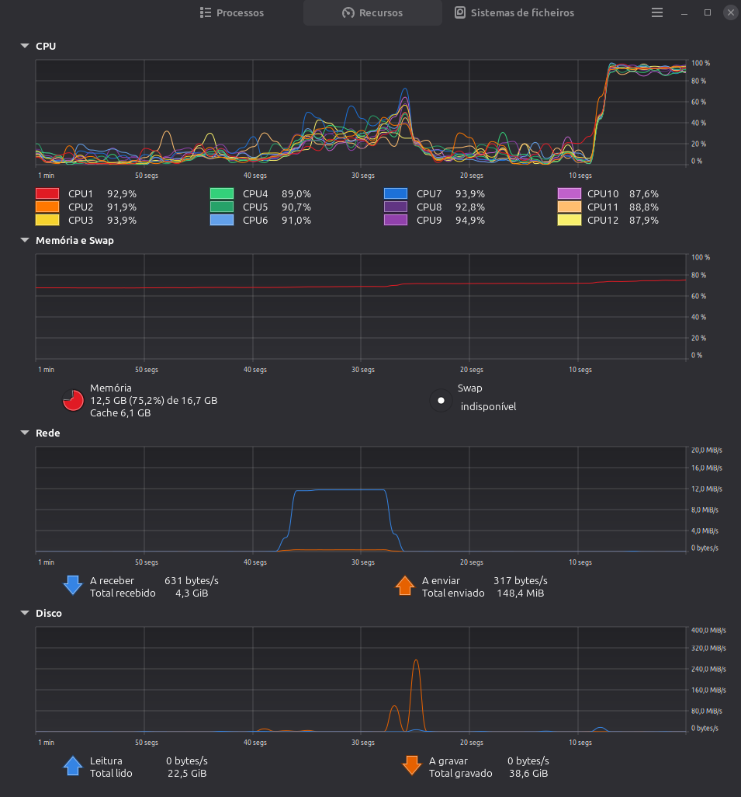

# Performance

- **Realistic Simulation Environment:** Since the system runs locally, a controlled high-load scenario was created focusing on the critical authentication component (`postgres_auth`), simulating concurrent access patterns across the entire ecosystem.

- **Load Testing Methodology:** The database engine was subjected to read-intensive queries (`SELECT`) using the industry-standard benchmarking tool `pgbench` to evaluate behavioral performance under direct concurrency.

- **Throughput Metrics Achieved:** The system stabilized at a massive capacity of **19,094.28 Transactions Per Second (TPS)**, successfully processing a total of 571,529 transactions within a 30-second duration.

- **Response Time Metrics:** The average latency per request settled at a highly responsive **4.19 ms**, ensuring the system performs well below critical tolerance thresholds.

# Scalability

- **Stress Testing Results:** System load was progressively scaled from 80 to 120 simultaneous concurrent clients to identify and map the precise infrastructure breaking points.

- **Hardware Bottleneck Identification:** At the stable tier of 80 concurrent clients, the CPU reached its maximum capacity, fluctuating between **91% and 95% utilization across all 12 logical cores**, while RAM usage remained secure and stable at 12.5 GB (75.2% of the available 16.7 GB).

- **Software Bottleneck Identification:** Upon expanding the load to 120 concurrent clients, the system reached the physical threshold of concurrent connections natively configured in PostgreSQL, resulting in an immediate failure due to connection exhaustion (`FATAL: sorry, too many clients already`).

# Architectural Proof (Scalability Plan)

- **Vertical Scalability:** Configuration of optimized resource directives in the PostgreSQL environment file, specifically expanding the `max_connections` parameter and tuning shared memory buffers.

- **Horizontal Scalability:** Planned deployment of a Connection Pooling mechanism (e.g., `PgBouncer`) to efficiently manage and reuse open sessions, significantly mitigating computational overhead on the CPU.

# Architectural Security Standards & Integrated Mechanisms

- **Robust Credential Cryptography:** User passwords are secured within the database using the Bcrypt strong hashing algorithm (leveraging the native `$2b$12$` hash signature), providing immunity against dictionary attacks and reverse engineering.

- **Prevention of Broken Access Control:** Implementation of a strict Role-Based Access Control (RBAC) model. Users are explicitly segregated by permission profiles within the database schema (e.g., `'Security'`, `'Cleaning'`, `'supervisor'`), preventing unauthorized access to administrative endpoints.

- **Data Segregation and Isolation:** Complete operational isolation is enforced by deploying independent database instances and persistent volumes per microservice within the Docker environment (`postgres_auth`, `postgres_map`, `postgres_chat`, `postgres_emergency`), strictly applying the principle of least privilege at the infrastructure tier.

# Validation of Critical Components

- **Concurrency Error Handling:** Validated asynchronous system behavior under a massive and continuous influx of geolocation events, injected simultaneously by the emulator through the `mosquitto` MQTT broker into the `event-processor`.

- **Transactional Consistency Assurance:** Logical mechanisms within core microservices (such as `map-service` and `routing-service`) are strictly enclosed within transactional blocks. This guarantees that if a complex geographic update process fails mid-execution, the database triggers an automatic rollback, preventing any data corruption.

- **Business Invariant Validation:** Enforcement of logical constraints and integrity checks within the codebase to actively reject impossible or anomalous data inputs, such as route coordinates or infrastructure states generated outside the defined physical perimeter of the stadium.